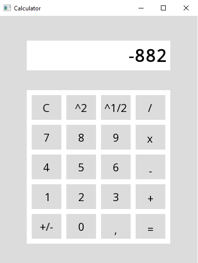

# Kalkulator okienkowy (08.2021)
Prosty oraz standardowy kalkulator z graficznym interfejsem użytkownika.

## Wymagania funkcjonalne:
* Dodawanie,
* Odejmowanie,
* Mnożenie,
* Dzielenie,
* Podniesienie do kwadratu,
* Pierwiastek kwadratowy,
* Zmiana znaku liczby,
* Czyszczenie wyniku.

## Technologie:
* Główny język - C++,
* GUI - SFML (biblioteka graficzna języka C++).

## Wygląd aplikacji:

    

